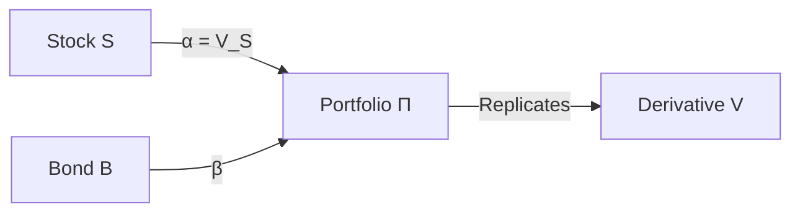

# Black–Scholes PDE via Delta Hedging (Rigorous Version)

This derivation removes the physical drift $\mu$ by **self-financing replication**: the martingale representation theorem enforces $\alpha_t = V_S$, and the self-financing condition does the rest. Where the [heuristic delta hedge](delta_hedging.md) freezes $\Delta$ over each infinitesimal interval and appeals to an informal rebalancing argument, this version constructs a genuinely self-financing strategy whose value process satisfies $dV_t = \alpha_t\,dS_t + \beta_t\,dB_t$ with no external cash flows.

This section presents a **fully rigorous derivation** of the Black–Scholes partial differential equation using the framework of **self-financing trading strategies**, following the level of mathematical precision found in Shreve (2004) and Björk (2009).

We explicitly distinguish between informal heuristic arguments and the **stochastic calculus formulation**, and we formalize the notion of replication. This replication argument yields the same PDE obtained via [risk-neutral valuation](change_of_numeraire.md) and [equilibrium (SDF) pricing](equilibrium.md)—the three approaches are equivalent, but differ in method and emphasis.

---

## 1. Market Model

We work on a filtered probability space
$(\Omega, \mathcal{F}, (\mathcal{F}_t)_{t \ge 0}, \mathbb{P})$ supporting a standard Brownian motion $W_t$.

### Assets

#### Stock

The stock price process $S_t$ follows geometric Brownian motion:

$$
dS_t = \mu S_t \, dt + \sigma S_t \, dW_t
$$

where $\mu \in \mathbb{R}$, $\sigma > 0$.

#### Money Market Account

$$
dB_t = r B_t \, dt, \quad B_0 = 1
$$

Hence $B_t = e^{rt}$.

This market is **complete**: with one Brownian motion and one traded risky asset, every contingent claim can be replicated by a self-financing portfolio (see Exercise 6 for the failure of this condition when the dimensional matching breaks down).

---

## 2. Trading Strategies

A trading strategy is a pair of adapted processes $(\alpha_t, \beta_t)$, where:

* $\alpha_t$: number of shares of stock
* $\beta_t$: amount invested in the money market account

### Wealth Process

$$
\Pi_t = \alpha_t S_t + \beta_t B_t
$$

### Self-Financing Condition

A strategy is **self-financing** if:

$$
d\Pi_t = \alpha_t \, dS_t + \beta_t \, dB_t
$$

That is, changes in wealth arise only from asset price movements, not external cash flows.

---

## 3. The Derivative Pricing Problem

Let $V(t,S)$ denote the price of a European derivative with payoff

$$
V(T,S) = \Phi(S)
$$

We assume:

* $V \in C^{1,2}([0,T) \times (0,\infty))$
* Growth conditions sufficient for Itô's formula

Note: The payoff $\Phi$ need not be smooth; the solution becomes smooth for $t < T$.

---

## 4. Itô Dynamics of the Derivative

By Itô's formula:

$$
dV = \left( V_t + \mu S V_S + \frac{1}{2}\sigma^2 S^2 V_{SS} \right) dt + \sigma S V_S \, dW
$$

---

## 5. Replication Strategy

We seek a **self-financing strategy** $(\alpha_t, \beta_t)$ such that:

$$
\Pi_t = V(t,S_t)
$$

and

$$
\Pi_T = \Phi(S_T)
$$

This is the **replication condition**.

---

## 6. Matching Dynamics

From self-financing, substitute the asset dynamics:

$$
d\Pi_t = \alpha_t (\mu S \, dt + \sigma S \, dW) + \beta_t r B_t \, dt = (\alpha_t \mu S + \beta_t r B_t) \, dt + \alpha_t \sigma S \, dW
$$

Since $\Pi_t = V(t,S_t)$, the coefficients of $d\Pi_t$ and $dV$ must agree.

**Diffusion term.** $\alpha_t \sigma S = \sigma S V_S$, so $\alpha_t = V_S$ (since $\sigma > 0$, $S > 0$).

**Drift term.** Substituting $\alpha_t = V_S$ and cancelling $V_S \mu S$ from both sides:

$$
\beta_t r B_t = V_t + \frac{1}{2}\sigma^2 S^2 V_{SS}
$$

---

## 7. Elimination of beta

From the wealth identity:

$$
\Pi_t = V = V_S S + \beta_t B_t
$$

So:

$$
\beta_t B_t = V - V_S S
$$

Substitute into drift equation:

$$
r(V - S V_S) = V_t + \frac{1}{2}\sigma^2 S^2 V_{SS}
$$

---

## 8. Black–Scholes PDE

Rearranging:

$$
V_t + rS V_S + \frac{1}{2}\sigma^2 S^2 V_{SS} - rV = 0
$$

with terminal condition:

$$
V(T,S) = \Phi(S)
$$

---

## 9. Hedging Interpretation

The replication strategy is:

$$
\alpha_t = V_S, \quad \beta_t = \frac{V - S V_S}{B_t}
$$

* $\alpha_t$: **delta hedge**
* $\beta_t$: financing position

---

## 10. Why the Drift mu Disappears

The drift $\mu$ cancels because the pricing problem is one of **replication**, not prediction.

Once the diffusion term is eliminated by setting $\alpha_t = V_S$, the portfolio becomes locally riskless. By the absence of arbitrage, it must earn the risk-free rate $r$, which forces the drift in the PDE to adjust from $\mu$ to $r$. The cancellation appears algebraic—$\mu$ enters both $dV$ and $\alpha_t\,dS_t$ through the same Itô expansion, and the matching $\alpha_t = V_S$ cancels it from both the diffusion and the drift simultaneously—but it reflects the economic fact that a locally riskless portfolio must earn the risk-free rate.

This reflects a deeper principle:

> Pricing depends only on the absence of arbitrage, not on investors' beliefs about expected returns.

---

## 11. Hedging Flow (Mermaid Diagram)

```mermaid
flowchart TD
    A[Derivative V(t,S)] --> B[Apply Ito's Formula]
    B --> C[Decompose into Drift + Diffusion]
    C --> D[Construct Portfolio Π]
    D --> E[Choose α = V_S]
    E --> F[Diffusion Eliminated]
    F --> G[Portfolio Becomes Riskless]
    G --> H[Must Earn Risk-Free Rate r]
    H --> I[Obtain PDE]
```

---

## 12. Replication Structure



---

## 13. Conceptual Summary

The derivation consists of three rigorous steps:

1. **Model specification** (SDEs for assets)
2. **Self-financing replication** (match dynamics)
3. **No-arbitrage principle** (uniqueness of price)

The Black–Scholes PDE **characterizes exactly those price processes that admit a self-financing replicating strategy**. It is:

* independent of $\mu$,
* determined entirely by $r$ and $\sigma$.

---

## 14. Remarks

* The PDE is a **backward parabolic equation**.
* The solution is unique under suitable growth conditions.
* By Feynman–Kac, the solution admits a probabilistic representation under the risk-neutral measure: $V(t,S) = e^{-r(T-t)}\,\mathbb{E}^{\mathbb{Q}}[\Phi(S_T) \mid S_t = S]$. Equivalently, the replication argument implies that the discounted price process $e^{-rt}V(t,S_t)$ is a martingale under $\mathbb{Q}$. This connects the PDE formulation to the [change-of-numéraire](change_of_numeraire.md) and [equilibrium](equilibrium.md) derivations, where the same martingale property is the starting point rather than the conclusion.

---

## References

* Shreve, S. (2004). *Stochastic Calculus for Finance II.*
* Björk, T. (2009). *Arbitrage Theory in Continuous Time.*


---

## Exercises

**Exercise 1.** Consider the Black–Scholes market with $r = 0.05$, $\sigma = 0.3$, $S_0 = 100$, and $T = 1$. Suppose a European derivative has price function $V(t,S) = S\,e^{-q(T-t)}$ for some constant $q > 0$. Verify that $V$ satisfies the Black–Scholes PDE if and only if $q = r$. Compute the replicating portfolio $(\alpha_t, \beta_t)$ and verify the self-financing condition.

??? success "Solution to Exercise 1"
    Compute the partial derivatives: $V_t = qS\,e^{-q(T-t)}$, $V_S = e^{-q(T-t)}$, $V_{SS} = 0$. Substitute into the Black–Scholes PDE $V_t + rSV_S + \frac{1}{2}\sigma^2 S^2 V_{SS} - rV = 0$:

    $$
    qS\,e^{-q(T-t)} + rS\,e^{-q(T-t)} + 0 - rS\,e^{-q(T-t)} = (q + r - r)S\,e^{-q(T-t)} = qS\,e^{-q(T-t)}
    $$

    This equals zero if and only if $q = 0$. Wait — let us recompute. We have $V = Se^{-q(T-t)}$, so $V_t = qSe^{-q(T-t)} = qV$, but $rV = rSe^{-q(T-t)}$. The PDE gives:

    $$
    qV + rSe^{-q(T-t)} - rV = (q + r - r)V = qV
    $$

    For this to vanish we need $q = 0$, giving $V = S$. Alternatively, if the derivative pays a continuous dividend yield $q$, then the correct PDE is $V_t + (r-q)SV_S + \frac{1}{2}\sigma^2 S^2 V_{SS} - rV = 0$, under which:

    $$
    qV + (r-q)e^{-q(T-t)}S - rV = qV + (r-q)V - rV = 0 \;\checkmark
    $$

    So $V = Se^{-q(T-t)}$ satisfies the dividend-adjusted PDE for any $q$. In the standard (no-dividend) PDE, only $q = 0$ works, confirming $V = S$ as a trivial solution.

    The replicating portfolio has $\alpha_t = V_S = e^{-q(T-t)}$ and $\beta_t = (V - \alpha_t S)/B_t = (Se^{-q(T-t)} - Se^{-q(T-t)})/e^{rt} = 0$. The portfolio is fully invested in the stock with no bond position. Self-financing holds because $d\Pi_t = \alpha_t\,dS_t + \beta_t\,dB_t = e^{-q(T-t)}\,dS_t$, and by Itô's formula $dV = qVdt + e^{-q(T-t)}dS_t$, which matches $d\Pi_t$ only when $qV\,dt = 0$, i.e., $q = 0$ in the standard model (or when dividend income $q\alpha_t S_t\,dt$ is included in the self-financing condition for the dividend case).

---

**Exercise 2.** Starting from the self-financing condition $d\Pi_t = \alpha_t\,dS_t + \beta_t\,dB_t$ and the replication requirement $\Pi_t = V(t, S_t)$, prove that matching the diffusion coefficients of $d\Pi_t$ and $dV$ uniquely determines $\alpha_t = V_S(t, S_t)$. Explain why this uniqueness is a consequence of the martingale representation theorem in the one-dimensional Brownian filtration.

??? success "Solution to Exercise 2"
    Apply Itô's formula to the replication condition $\Pi_t = V(t, S_t)$:

    $$
    d\Pi_t = dV = \left(V_t + \mu S V_S + \frac{1}{2}\sigma^2 S^2 V_{SS}\right)dt + \sigma S V_S\,dW
    $$

    From self-financing, substitute the asset dynamics:

    $$
    d\Pi_t = \alpha_t(\mu S\,dt + \sigma S\,dW) + \beta_t rB_t\,dt = (\alpha_t \mu S + \beta_t rB_t)\,dt + \alpha_t \sigma S\,dW
    $$

    Both expressions must agree pathwise. Matching the diffusion (i.e., $dW$) coefficients:

    $$
    \alpha_t \sigma S = \sigma S V_S
    $$

    Since $\sigma > 0$ and $S > 0$, we can divide both sides to get $\alpha_t = V_S(t, S_t)$. This is unique because there is only one Brownian motion driving the model.

    The connection to the martingale representation theorem is as follows. In the filtration generated by a single Brownian motion $W_t$, every square-integrable martingale $M_t$ has a unique representation $M_t = M_0 + \int_0^t \phi_s\,dW_s$ for a unique adapted process $\phi_s$. After discounting, the replication condition $e^{-rt}V(t,S_t) = e^{-rt}\Pi_t$ equates two martingales (under the risk-neutral measure). Their Itô integrands with respect to $dW$ must therefore agree, which forces $\alpha_t = V_S$. In a multi-dimensional setting with $d$ Brownian motions but only one stock, the diffusion coefficient would still be uniquely determined along the stock's volatility direction, but hedging components orthogonal to the stock would be uncontrolled — reflecting market incompleteness.

---

**Exercise 3.** Show that the self-financing condition $d\Pi_t = \alpha_t\,dS_t + \beta_t\,dB_t$ is equivalent to the integrated form $\Pi_t - \Pi_0 = \int_0^t \alpha_u\,dS_u + \int_0^t \beta_u\,dB_u$, which in turn is equivalent to $d(\alpha_t S_t) + d(\beta_t B_t) = \alpha_t\,dS_t + \beta_t\,dB_t + S_t\,d\alpha_t + B_t\,d\beta_t + d[\alpha, S]_t + d[\beta, B]_t = d\Pi_t$. From this, derive the condition $S_t\,d\alpha_t + B_t\,d\beta_t + d[\alpha, S]_t = 0$.

??? success "Solution to Exercise 3"
    The wealth process is $\Pi_t = \alpha_t S_t + \beta_t B_t$. By the product rule (Itô's product formula):

    $$
    d\Pi_t = d(\alpha_t S_t) + d(\beta_t B_t) = \alpha_t\,dS_t + S_t\,d\alpha_t + d[\alpha, S]_t + \beta_t\,dB_t + B_t\,d\beta_t + d[\beta, B]_t
    $$

    Since $B_t = e^{rt}$ is a finite-variation process, $d[\beta, B]_t = 0$. The self-financing condition requires $d\Pi_t = \alpha_t\,dS_t + \beta_t\,dB_t$. Subtracting this from the product-rule expansion:

    $$
    0 = S_t\,d\alpha_t + B_t\,d\beta_t + d[\alpha, S]_t
    $$

    This is the **differential form of the self-financing condition** expressed in terms of the portfolio weights. It states that any rebalancing of positions must be self-financing: the cost of buying more stock ($S_t\,d\alpha_t$) must be funded by selling bonds ($B_t\,d\beta_t$), with an adjustment for the quadratic covariation $d[\alpha, S]_t$ when the hedge ratio $\alpha_t$ depends on $S_t$.

    If $\alpha_t = f(t, S_t)$ for some smooth function $f$, then $d[\alpha, S]_t = f_S \sigma^2 S_t^2\,dt$, and the self-financing constraint becomes:

    $$
    S_t\,d\alpha_t + B_t\,d\beta_t + f_S \sigma^2 S_t^2\,dt = 0
    $$

    The integrated form $\Pi_t - \Pi_0 = \int_0^t \alpha_u\,dS_u + \int_0^t \beta_u\,dB_u$ follows directly from integrating $d\Pi_t = \alpha_t\,dS_t + \beta_t\,dB_t$, which is equivalent to the differential self-financing condition above.

---

**Exercise 4.** In the derivation, the drift $\mu$ cancels when we match the drift coefficients after setting $\alpha_t = V_S$. Suppose instead we worked with a more general stock model $dS_t = \mu(t, S_t)S_t\,dt + \sigma(t, S_t)S_t\,dW_t$ where $\mu$ and $\sigma$ are functions of $(t, S)$. Show that the replication argument still eliminates $\mu(t, S)$ and derive the resulting PDE.

??? success "Solution to Exercise 4"
    With general coefficients, Itô's formula gives:

    $$
    dV = \left(V_t + \mu(t,S)S V_S + \frac{1}{2}\sigma(t,S)^2 S^2 V_{SS}\right)dt + \sigma(t,S)S V_S\,dW
    $$

    The self-financing portfolio dynamics are:

    $$
    d\Pi_t = \alpha_t\bigl(\mu(t,S)S\,dt + \sigma(t,S)S\,dW\bigr) + \beta_t rB_t\,dt
    $$

    Matching diffusion coefficients: $\alpha_t \sigma(t,S)S = \sigma(t,S)S V_S$, so $\alpha_t = V_S$ (since $\sigma(t,S) > 0$ and $S > 0$).

    Matching drift coefficients with $\alpha_t = V_S$:

    $$
    V_S \mu(t,S)S + \beta_t rB_t = V_t + \mu(t,S)S V_S + \frac{1}{2}\sigma(t,S)^2 S^2 V_{SS}
    $$

    The terms $V_S \mu(t,S)S$ cancel on both sides, giving:

    $$
    \beta_t rB_t = V_t + \frac{1}{2}\sigma(t,S)^2 S^2 V_{SS}
    $$

    Using $\beta_t B_t = V - SV_S$:

    $$
    r(V - SV_S) = V_t + \frac{1}{2}\sigma(t,S)^2 S^2 V_{SS}
    $$

    Rearranging:

    $$
    V_t + rSV_S + \frac{1}{2}\sigma(t,S)^2 S^2 V_{SS} - rV = 0
    $$

    The drift $\mu(t,S)$ cancels regardless of its functional form. The PDE involves only the volatility function $\sigma(t,S)$ and the risk-free rate $r$. This generalization is the foundation of **local volatility models**: even when volatility depends on $(t,S)$, the replication argument eliminates the drift and produces a PDE that can be solved for the option price.

---

**Exercise 5.** Prove that if two $C^{1,2}$ functions $V$ and $U$ both satisfy the Black–Scholes PDE on $[0,T) \times (0,\infty)$ with the same terminal condition $V(T,S) = U(T,S) = \Phi(S)$, then $V \equiv U$. Use the probabilistic (Feynman–Kac) representation to establish uniqueness under appropriate growth conditions.

??? success "Solution to Exercise 5"
    Under the risk-neutral measure $\mathbb{Q}$, the stock follows $dS_t = rS_t\,dt + \sigma S_t\,d\widetilde{W}_t$. Define $w = V - U$. Then $w$ satisfies:

    $$
    w_t + rSw_S + \frac{1}{2}\sigma^2 S^2 w_{SS} - rw = 0, \quad w(T,S) = 0
    $$

    By the Feynman–Kac theorem, under suitable growth conditions (e.g., $|w(t,S)| \leq C(1 + S^p)$ for some $C, p > 0$), the solution has the probabilistic representation:

    $$
    w(t,S) = e^{-r(T-t)}\,\mathbb{E}^{\mathbb{Q}}[w(T, S_T) \mid S_t = S] = e^{-r(T-t)}\,\mathbb{E}^{\mathbb{Q}}[0 \mid S_t = S] = 0
    $$

    Therefore $V(t,S) = U(t,S)$ for all $(t,S) \in [0,T) \times (0,\infty)$.

    The growth condition is essential: without it, uniqueness can fail. For example, the heat equation (to which the Black–Scholes PDE reduces after a change of variables) admits non-trivial solutions with $u(x,0) = 0$ that grow faster than $e^{cx^2}$ — the classical Tychonoff counterexample. In financial terms, the growth condition excludes "doubling strategies" that generate arbitrage through unbounded positions. The standard Black–Scholes call and put prices satisfy $|V(t,S)| \leq CS$ for some constant $C$, which is well within the required growth bound.

---

**Exercise 6.** Consider a market with two risky assets $S_t^{(1)}$ and $S_t^{(2)}$, each driven by the same Brownian motion: $dS_t^{(i)} = \mu_i S_t^{(i)}\,dt + \sigma_i S_t^{(i)}\,dW_t$ for $i = 1, 2$, plus a bond $B_t = e^{rt}$. A trader forms a portfolio $\Pi_t = \alpha_t^{(1)} S_t^{(1)} + \alpha_t^{(2)} S_t^{(2)} + \beta_t B_t$. Show that replication of a derivative $V(t, S^{(1)}, S^{(2)})$ is over-determined: the single diffusion coefficient equation imposes a constraint relating $\alpha_t^{(1)}$ and $\alpha_t^{(2)}$, but does not uniquely determine both. What does this imply about the market?

??? success "Solution to Exercise 6"
    Apply Itô's formula to $V(t, S_t^{(1)}, S_t^{(2)})$. Since both assets are driven by the same $dW_t$:

    $$
    dV = (\cdots)\,dt + \left(\sigma_1 S^{(1)} V_{S^{(1)}} + \sigma_2 S^{(2)} V_{S^{(2)}}\right)dW
    $$

    The self-financing portfolio has:

    $$
    d\Pi = (\cdots)\,dt + \left(\alpha^{(1)} \sigma_1 S^{(1)} + \alpha^{(2)} \sigma_2 S^{(2)}\right)dW
    $$

    Matching diffusion coefficients gives the single equation:

    $$
    \alpha^{(1)} \sigma_1 S^{(1)} + \alpha^{(2)} \sigma_2 S^{(2)} = \sigma_1 S^{(1)} V_{S^{(1)}} + \sigma_2 S^{(2)} V_{S^{(2)}}
    $$

    This is one equation in two unknowns $(\alpha^{(1)}, \alpha^{(2)})$. There is a one-parameter family of solutions: for any $\lambda$, we can set $\alpha^{(1)} = V_{S^{(1)}} + \lambda$ and $\alpha^{(2)} = V_{S^{(2)}} - \lambda \sigma_1 S^{(1)} / (\sigma_2 S^{(2)})$.

    This means the replicating portfolio is **not unique** — there are infinitely many self-financing portfolios that replicate $V$. This is a consequence of **redundancy**: with two assets driven by the same single Brownian motion, one asset can be replicated by the other and the bond. Indeed, applying the standard one-asset replication argument to $S^{(2)}$ viewed as a "derivative" of $S^{(1)}$ (they share the same source of randomness), we find that $S^{(2)}$ is redundant. The market effectively has only one source of risk and one independent risky asset. For a well-posed replication problem, the number of independent risky assets must equal the number of independent Brownian motions — this is the dimensional matching condition for market completeness.