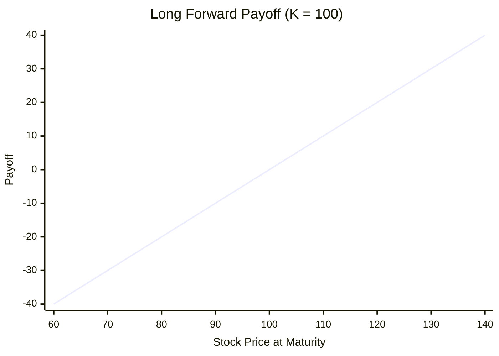

# Payoff of Forwards and Futures

**Key idea**: Linear payoffs imply symmetric risk and static replication — no dynamic hedging is needed.

## One Concrete Payoff

Before any formula, picture a single contract with delivery price $K = 100$. Three possible outcomes at maturity:

- $S_T = 120$ → the long buys at \$100 an asset worth \$120, gaining \$20; the short loses \$20.
- $S_T = 100$ → both sides break even.
- $S_T = 80$ → the long is forced to buy at \$100 an asset worth \$80, losing \$20; the short gains \$20.

Plot these three points $(80, -20), (100, 0), (120, 20)$ for the long side: they lie on the straight line $y = S_T - 100$. Plot the short side: they lie on $y = 100 - S_T$. No matter how many additional values of $S_T$ are sampled — \$30, \$300, \$1,000 — the points stay on these same two lines. This single observation, that **every long-forward payoff sits on one straight line through $(K, 0)$ with slope $+1$**, is the entire content of the formulas below. The rest of this section just gives names to the line, its mirror image, and the consequences of being a line rather than a kinked curve.

The previous sections defined forward and futures contracts and described their mechanics. We now turn to a precise question: what is a forward position worth at maturity? Unlike options, whose payoffs are kinked and bounded below by zero, the forward payoff is **linear** in the underlying price and can take negative values. This simplicity is both a strength and a risk: it makes pricing elegant but exposes both parties to losses in every state of the world.

---

## Long Forward Payoff

The holder of a long forward contract is obligated to buy the underlying asset at the agreed delivery price $K$ at maturity $T$. If the spot price at maturity is $S_T$, the holder pays $K$ for an asset worth $S_T$. The payoff is

$$
\text{Long forward payoff} = S_T - K
$$

This expression is unrestricted in sign. When $S_T > K$, the holder profits by acquiring the asset below market value. When $S_T < K$, the holder is forced to buy at a price above the market, resulting in a loss. There is no optionality — the contract must be settled regardless.

---

## Short Forward Payoff

The holder of a short forward contract is obligated to sell the underlying asset at $K$ at maturity. The short side's payoff is

$$
\text{Short forward payoff} = K - S_T
$$

This is the exact mirror image of the long payoff. The forward market is zero-sum: the long side's gain is the short side's loss, and vice versa. For every dollar the long makes when $S_T$ rises, the short loses a dollar, and conversely when $S_T$ falls.

---

## Key Contrast with Options

The defining feature of option payoffs is the $(\cdot)^+$ operator, which floors the payoff at zero. The forward has no such floor. Comparing the long call payoff $(S_T - K)^+$ with the long forward payoff $S_T - K$ makes the difference stark:

- **Options**: payoff is nonlinear (kinked at $K$), always non-negative for the holder.
- **Forwards**: payoff is linear (a straight line through zero at $S_T = K$), and the holder can lose as much as the holder can gain.

This linearity means that the holder of a forward takes on **symmetric risk**: the upside is unlimited, but so is the downside. The option holder, by contrast, truncates the downside at the cost of paying a premium upfront.

---

## Numeric Example

Consider a forward contract with delivery price $K = 100$. We compute payoffs at three representative spot prices:

| $S_T$ | Long payoff ($S_T - K$) | Short payoff ($K - S_T$) |
|---|---|---|
| 80 | $80 - 100 = -\$20$ | $100 - 80 = \$20$ |
| 100 | $100 - 100 = \$0$ | $100 - 100 = \$0$ |
| 120 | $120 - 100 = \$20$ | $100 - 120 = -\$20$ |

When $S_T = 80$, the long side loses \$20 — there is no protection. When $S_T = 120$, the long side gains \$20. At $S_T = K = 100$, both sides break even. The payoffs always sum to zero.

---

## Payoff Profile Table

The following table shows the payoff shape across a wider range of spot prices, for a forward with delivery price $K = 100$:

| $S_T$ | 60 | 70 | 80 | 90 | 100 | 110 | 120 | 130 | 140 |
|---|---|---|---|---|---|---|---|---|---|
| **Long** ($S_T - K$) | $-40$ | $-30$ | $-20$ | $-10$ | $0$ | $10$ | $20$ | $30$ | $40$ |
| **Short** ($K - S_T$) | $40$ | $30$ | $20$ | $10$ | $0$ | $-10$ | $-20$ | $-30$ | $-40$ |

The long payoff is a straight line with slope $+1$, crossing zero at $S_T = K$. The short payoff is a straight line with slope $-1$, crossing zero at the same point. There is no kink, no flat region, and no floor — a sharp contrast with the "hockey stick" shape of option payoffs.

---

## Payoff Diagram

The long forward payoff is a straight line passing through zero at $S_T = K = 100$, with slope $+1$:

Compare this with the long call payoff at the same strike. The call follows the forward for $S_T > K$ but is floored at zero for $S_T \leq K$. The region between the two lines for $S_T < K$ represents the downside protection that the option provides — and that the forward does not.

---

## Connection to Put-Call Parity

Recall (see [§ From Forwards to Options](bridge_to_options.md)): the payoff identity $(S_T - K)^+ - (K - S_T)^+ = S_T - K$ shows that a long call plus a short put replicates a long forward — the payoff-level version of put-call parity.

---

## Bridge to Pricing

Linearity of $S_T - K$ in $S_T$ is what makes forwards tractable: pricing reduces to **static replication** (buy the asset, borrow the present value of $K$). Recall (see [§ No-Arbitrage Pricing of Forwards](no_arbitrage_pricing.md)): this replication pins down $F_0 = S_0 e^{rT}$ without any dynamic adjustment.

Nonlinear payoffs such as $(S_T - K)^+$ cannot be matched by any static stock-and-bond portfolio and demand dynamic hedging — see [§ From Forwards to Options](bridge_to_options.md) for the precise contrast.

---

## Exercises

**Exercise 1.** A forward contract on a stock has delivery price $K = 150$. Compute the long and short payoffs at maturity for each of the following spot prices: (a) $S_T = 120$, (b) $S_T = 150$, (c) $S_T = 185$.

??? success "Solution to Exercise 1"
    Using the long payoff $S_T - K$ and the short payoff $K - S_T$:

    (a) Long: $120 - 150 = -\$30$. Short: $150 - 120 = \$30$.

    (b) Long: $150 - 150 = \$0$. Short: $150 - 150 = \$0$. Both sides break even.

    (c) Long: $185 - 150 = \$35$. Short: $150 - 185 = -\$35$.

    In every case, the two payoffs sum to zero, confirming that the forward is a zero-sum contract.

---

**Exercise 2.** A trader enters a long forward at delivery price $K = 100$ and simultaneously buys a European put with the same strike $K = 100$ and maturity, paying a premium of \$7. (a) Write the combined payoff at maturity as a function of $S_T$. (b) What familiar payoff does this resemble? (c) For what value of $S_T$ does the trader break even (combined profit $= 0$)?

??? success "Solution to Exercise 2"
    (a) The combined payoff at maturity is

    $$
    (S_T - K) + (K - S_T)^+ = (S_T - K)^+
    $$

    by the decomposition identity. This is the payoff of a long call with strike $K$.

    (b) The combined position replicates a **long call** payoff with strike $K = 100$.

    (c) The total cost is the put premium of \$7 (the forward costs nothing to enter). Profit is $(S_T - 100)^+ - 7$. Setting this to zero: $S_T - 100 = 7$, so $S_T^* = 107$.

---

**Exercise 3.** Prove that for any $S_T \geq 0$ and $K > 0$, the long forward payoff satisfies $|S_T - K| = (S_T - K)^+ + (K - S_T)^+$. Interpret this identity in terms of option payoffs.

??? success "Solution to Exercise 3"
    Consider two cases.

    **Case 1: $S_T \geq K$.** Then $(S_T - K)^+ = S_T - K$ and $(K - S_T)^+ = 0$. The right side is $S_T - K = |S_T - K|$. $\square$

    **Case 2: $S_T < K$.** Then $(S_T - K)^+ = 0$ and $(K - S_T)^+ = K - S_T$. The right side is $K - S_T = |S_T - K|$. $\square$

    **Interpretation:** the absolute value of the forward payoff equals the sum of the call and put payoffs at the same strike. A position that is long a call *and* long a put (a **straddle**) has payoff $|S_T - K|$, which is always non-negative and equals the magnitude of the forward payoff. The straddle profits from large moves in either direction.

---

**Exercise 4.** A forward contract has delivery price $K = 100$. An investor enters the long forward and also writes a European call with strike $K = 100$ and same maturity, receiving a premium of \$12. (a) Write the combined payoff at maturity. (b) What is the maximum and minimum profit of this combined position? (c) Identify the equivalent option position.

??? success "Solution to Exercise 4"
    (a) The combined payoff is

    $$
    (S_T - K) - (S_T - K)^+
    $$

    If $S_T \geq K$: $(S_T - K) - (S_T - K) = 0$. If $S_T < K$: $(S_T - K) - 0 = S_T - K < 0$. So the combined payoff is $-(K - S_T)^+$, i.e., the payoff of a **short put**.

    (b) Profit $= -(K - S_T)^+ + 12$. Maximum profit is \$12 (when $S_T \geq 100$, payoff is zero). Minimum profit is $-(100) + 12 = -\$88$ (in the extreme case $S_T = 0$, payoff is $-100$).

    (c) The combined position is equivalent to a **short put** with strike $K = 100$.

---

**Exercise 5.** Without using any option pricing formula, explain why a forward contract with delivery price equal to the current forward price $F_0$ has zero value at inception. Use only the linearity of the forward payoff and a no-arbitrage argument.

??? success "Solution to Exercise 5"
    The forward price $F_0$ is defined as the delivery price at which the forward contract has zero value at inception. Suppose the contract had positive value to the long side at $K = F_0$. Then every trader would want to enter the long side, but no one would take the short side — a contradiction, since forward contracts require both parties.

    More precisely, the forward payoff $S_T - K$ is linear in $K$. By no-arbitrage, the present value of the payoff must be zero when $K = F_0$:

    $$
    \text{PV}(S_T - F_0) = \text{PV}(S_T) - F_0 \cdot \text{PV}(1) = 0
    $$

    This gives $F_0 = \text{PV}(S_T) / \text{PV}(1) = S_0 / B(0,T)$, where $B(0,T)$ is the discount factor. The linearity of the payoff is what makes this static argument work: we need only price two known quantities ($S_T$ and a constant $F_0$) separately, without any model for the distribution of $S_T$. This is precisely the simplification that linearity affords.

---

**Exercise 6.** A trader simultaneously holds a long call and a long put on the same underlying, both with strike $K$ and maturity $T$ (a **straddle**). Sketch the payoff at maturity, identify the minimum payoff, and compare to a long forward at delivery price $K$.

??? success "Solution to Exercise 6"
    The straddle payoff is $(S_T - K)^+ + (K - S_T)^+ = |S_T - K|$, which is non-negative everywhere and equals zero only at $S_T = K$. It is V-shaped with vertex at $S_T = K$, slope $-1$ to the left and slope $+1$ to the right.

    The minimum payoff is $0$, attained at $S_T = K$.

    A long forward at delivery price $K$ has payoff $S_T - K$ — a straight line that is negative for $S_T < K$ and positive for $S_T > K$. The straddle equals the **absolute value** of the forward payoff: it profits from movement in either direction but always pays at least $0$ (so it costs an upfront premium, unlike the forward which is free to enter).
