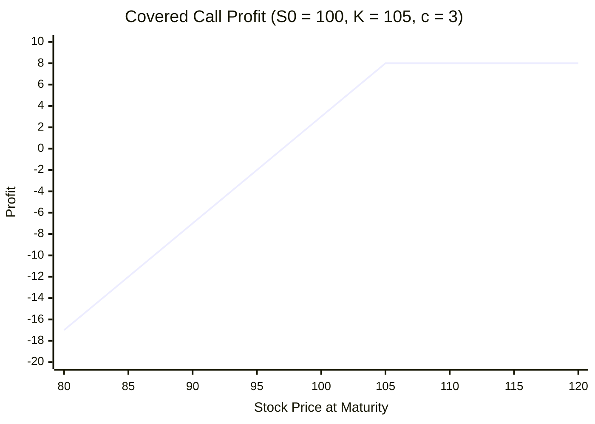
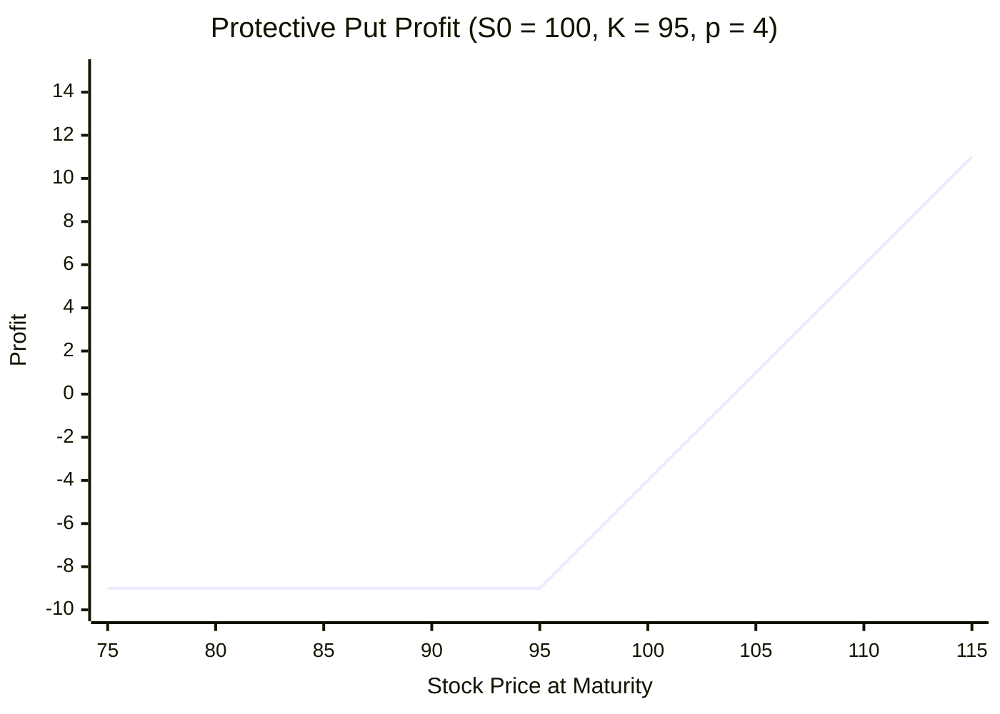

# Basic Option Strategies

An option on its own provides leveraged, directional exposure. But the real utility of options emerges when they are combined with other positions — with the underlying stock, with other options, or with both. This section catalogs the four elementary single-option positions, establishes the symmetry between long and short sides, and then introduces the two most important option-stock combinations: the covered call and the protective put. These strategies illustrate the core principle that will drive the rest of this chapter: options allow investors to reshape the payoff profile of a portfolio, and pricing them correctly is essential for any rational hedging decision.

---

## The Four Elementary Positions

Every option strategy is built from four atomic building blocks. Let $S_T$ denote the stock price at maturity, $K$ the strike price, and $c$ the call premium and $p$ the put premium paid at inception. From this point on, we distinguish **payoff** (the value received at maturity, always non-negative for long positions) from **profit** (payoff minus premium, which can be negative).

### Long Call

The holder pays premium $c$ and receives the right to buy at $K$. The payoff at maturity is $(S_T - K)^+$, so the profit is

$$
\Pi_{\text{long call}} = (S_T - K)^+ - c
$$

- **Max profit**: unlimited (as $S_T \to \infty$)
- **Max loss**: $c$ (the premium paid)
- **Breakeven**: $S_T = K + c$

### Short Call

The writer receives premium $c$ and bears the obligation to sell at $K$. By the linearity of profit, the short position is the exact negative of the long:

$$
\Pi_{\text{short call}} = c - (S_T - K)^+
$$

- **Max profit**: $c$
- **Max loss**: unlimited
- **Breakeven**: $S_T = K + c$

### Long Put

The holder pays premium $p$ and receives the right to sell at $K$:

$$
\Pi_{\text{long put}} = (K - S_T)^+ - p
$$

- **Max profit**: $K - p$ (attained when $S_T = 0$)
- **Max loss**: $p$
- **Breakeven**: $S_T = K - p$

### Short Put

The writer receives premium $p$ and bears the obligation to buy at $K$:

$$
\Pi_{\text{short put}} = p - (K - S_T)^+
$$

- **Max profit**: $p$
- **Max loss**: $K - p$
- **Breakeven**: $S_T = K - p$

### Payoff Symmetry

The key structural observation is that **long and short positions are mirror images**. For any option with payoff $\Pi_{\text{long}}$, the short side has $\Pi_{\text{short}} = -\Pi_{\text{long}}$, so every dollar gained by one party is lost by the other. This zero-sum property is summarized in the following table:

| Position | Payoff at Maturity | Max Profit | Max Loss | Breakeven |
|---|---|---|---|---|
| Long call | $(S_T - K)^+ - c$ | $\infty$ | $c$ | $K + c$ |
| Short call | $c - (S_T - K)^+$ | $c$ | $\infty$ | $K + c$ |
| Long put | $(K - S_T)^+ - p$ | $K - p$ | $p$ | $K - p$ |
| Short put | $p - (K - S_T)^+$ | $p$ | $K - p$ | $K - p$ |

---

## Covered Call

A **covered call** consists of a long position in the stock combined with a short call on the same stock:

$$
\Pi_{\text{covered call}} = (S_T - S_0) + [c - (S_T - K)^+]
$$

where $S_0$ is the initial stock price. Evaluating piecewise:

$$
\Pi_{\text{covered call}} =
\begin{cases}
S_T - S_0 + c & \text{if } S_T \leq K \\
K - S_0 + c & \text{if } S_T > K
\end{cases}
$$

- **Max profit**: $K - S_0 + c$ (capped at the strike)
- **Max loss**: $S_0 - c$ (if the stock falls to zero)
- **Breakeven**: $S_T = S_0 - c$

The covered call sacrifices upside beyond $K$ in exchange for the premium income $c$. It is the most widely used option strategy in practice because it converts uncertain upside into immediate income, favored when the investor holds stock and has a neutral-to-mildly-bullish outlook.

---

## Protective Put

A **protective put** consists of a long position in the stock combined with a long put on the same stock:

$$
\Pi_{\text{protective put}} = (S_T - S_0) + [(K - S_T)^+ - p]
$$

Evaluating piecewise:

$$
\Pi_{\text{protective put}} =
\begin{cases}
K - S_0 - p & \text{if } S_T \leq K \\
S_T - S_0 - p & \text{if } S_T > K
\end{cases}
$$

- **Max profit**: unlimited (reduced by the premium $p$)
- **Max loss**: $S_0 - K + p$ (bounded, regardless of how far the stock falls)
- **Breakeven**: $S_T = S_0 + p$

The protective put is effectively an insurance policy: the investor pays premium $p$ to guarantee that losses on the stock never exceed $S_0 - K + p$, while retaining full participation in any upside.

---

## From Strategies to Pricing Theory

The covered call and protective put reveal a fundamental question. In the covered call, the investor is willing to cap upside in exchange for immediate income; in the protective put, the investor pays a premium for downside protection. Both strategies reshape the distribution of portfolio returns — but how much should that reshaping cost?

If the premium is too low, the option writer gives away valuable protection; if too high, the buyer overpays for a guarantee. A mispriced option creates an arbitrage opportunity when combined with the underlying stock. Determining the unique no-arbitrage price requires a model of how $S_T$ behaves — which is precisely the problem that the Black-Scholes framework, developed in the subsequent sections, solves.

---

## Exercises

**Exercise 1.** A stock trades at $S_0 = \$50$. A European call with strike $K = 55$ and maturity $T = 3$ months costs $c = \$2.50$. Compute the profit $\Pi$ for the call buyer when (a) $S_T = 60$, (b) $S_T = 55$, and (c) $S_T = 48$. State the breakeven stock price.

??? success "Solution to Exercise 1"
    The profit for a long call is $\Pi = (S_T - K)^+ - c$.

    **(a)** $S_T = 60$:

    $$
    \Pi = (60 - 55)^+ - 2.50 = 5 - 2.50 = 2.50
    $$

    **(b)** $S_T = 55$:

    $$
    \Pi = (55 - 55)^+ - 2.50 = 0 - 2.50 = -2.50
    $$

    **(c)** $S_T = 48$:

    $$
    \Pi = (48 - 55)^+ - 2.50 = 0 - 2.50 = -2.50
    $$

    The breakeven stock price is $K + c = 55 + 2.50 = 57.50$. Below this level, the call buyer incurs a net loss; above it, the buyer profits.

---

**Exercise 2.** Verify the zero-sum property: if a call buyer's profit at maturity is $\Pi_{\text{long}}$, show algebraically that the call writer's profit satisfies $\Pi_{\text{short}} = -\Pi_{\text{long}}$ in both cases $S_T > K$ and $S_T \leq K$.

??? success "Solution to Exercise 2"
    **Case 1: $S_T > K$.** The call is exercised.

    $$
    \Pi_{\text{long}} = (S_T - K) - c
    $$

    $$
    \Pi_{\text{short}} = c - (S_T - K)
    $$

    Adding: $\Pi_{\text{long}} + \Pi_{\text{short}} = (S_T - K) - c + c - (S_T - K) = 0$, so $\Pi_{\text{short}} = -\Pi_{\text{long}}$.

    **Case 2: $S_T \leq K$.** The call expires worthless.

    $$
    \Pi_{\text{long}} = 0 - c = -c
    $$

    $$
    \Pi_{\text{short}} = c - 0 = c
    $$

    Again $\Pi_{\text{long}} + \Pi_{\text{short}} = -c + c = 0$. In both cases the short profit is the exact negative of the long profit, confirming the zero-sum property. $\square$

---

**Exercise 3.** An investor holds 100 shares of a stock currently priced at $S_0 = \$80$ and writes a covered call with strike $K = 90$ for a premium of $c = \$3$ per share. (a) Compute the profit on the combined position if $S_T = 95$. (b) Compute the profit if $S_T = 70$. (c) At what stock price does the covered call position break even?

??? success "Solution to Exercise 3"
    Per share, the covered call profit is

    $$
    \Pi = (S_T - S_0) + c - (S_T - K)^+
    $$

    **(a)** $S_T = 95 > K = 90$:

    $$
    \Pi = (95 - 80) + 3 - (95 - 90) = 15 + 3 - 5 = 13
    $$

    Total for 100 shares: $100 \times 13 = \$1{,}300$.

    Note that the upside is capped: even though the stock rose \$15, the profit is only \$13 because the call was exercised against the investor.

    **(b)** $S_T = 70 < K$:

    $$
    \Pi = (70 - 80) + 3 - 0 = -10 + 3 = -7
    $$

    Total for 100 shares: $100 \times (-7) = -\$700$.

    The premium partially offsets the stock decline.

    **(c)** Breakeven requires $\Pi = 0$. For $S_T \leq K$, the profit is $S_T - S_0 + c = S_T - 80 + 3 = S_T - 77$. Setting this to zero gives $S_T = 77$. (For $S_T > K$, the profit is $K - S_0 + c = 13 > 0$, so breakeven occurs only on the downside.) The breakeven price is $\$77$.

---

**Exercise 4.** An investor buys a stock at $S_0 = \$100$ and simultaneously buys a protective put with strike $K = 95$ for a premium of $p = \$4$. (a) What is the maximum loss on this position? (b) Derive the breakeven stock price. (c) Compare the protective put to simply holding the stock without a put: for what range of $S_T$ does the unprotected stock position outperform?

??? success "Solution to Exercise 4"
    The protective put profit per share is

    $$
    \Pi = (S_T - S_0) + (K - S_T)^+ - p
    $$

    **(a)** The worst case occurs when $S_T \leq K = 95$, giving

    $$
    \Pi = (S_T - 100) + (95 - S_T) - 4 = -9
    $$

    The maximum loss is \$9 per share, regardless of how far the stock falls. Without the put, a drop to $S_T = 0$ would lose \$100.

    **(b)** For $S_T > K$, the put expires worthless and

    $$
    \Pi = S_T - 100 - 4 = S_T - 104
    $$

    Setting $\Pi = 0$ gives $S_T = 104$. The breakeven price is $\$104$.

    **(c)** The unprotected stock profit is $S_T - 100$. The protective put profit is

    $$
    \Pi_{\text{pp}} =
    \begin{cases}
    -9 & \text{if } S_T \leq 95 \\
    S_T - 104 & \text{if } S_T > 95
    \end{cases}
    $$

    For $S_T > 95$, the unprotected stock outperforms by exactly the put premium: $(S_T - 100) - (S_T - 104) = 4$. For $S_T \leq 95$, the unprotected stock outperforms only when $S_T - 100 > -9$, i.e., $S_T > 91$. Therefore the unprotected stock outperforms for $S_T > 91$, and the protective put outperforms for $S_T < 91$. The insurance is valuable precisely in severe downturns.

---

**Exercise 5.** Using the payoff formulas from this section, show that the following identity holds for all $S_T \geq 0$:

$$
\underbrace{(S_T - S_0) + [(K - S_T)^+ - p]}_{\text{protective put}} = \underbrace{[(S_T - K)^+ - c] + [Ke^{-rT} \cdot e^{rT} - S_0] + (c - p)}_{\text{long call + bond + premium difference}}
$$

under the assumption that put-call parity holds (i.e., $c - p = S_0 - Ke^{-rT}$). Explain why this means a protective put can be replicated by a long call plus a risk-free bond.

??? success "Solution to Exercise 5"
    Start with the protective put profit:

    $$
    \Pi_{\text{pp}} = (S_T - S_0) + (K - S_T)^+ - p
    $$

    Consider two cases.

    **Case 1: $S_T > K$.** The put expires worthless:

    $$
    \Pi_{\text{pp}} = S_T - S_0 - p
    $$

    A long call plus bond gives: $(S_T - K) - c + (K - S_0) + (c - p) = S_T - S_0 - p$. These are equal.

    **Case 2: $S_T \leq K$.** The put is exercised:

    $$
    \Pi_{\text{pp}} = S_T - S_0 + K - S_T - p = K - S_0 - p
    $$

    A long call (expires worthless) plus bond gives: $0 - c + (K - S_0) + (c - p) = K - S_0 - p$. These are equal.

    The identity holds in all states because put-call parity ensures $c - p = S_0 - Ke^{-rT}$, which means the net initial cost of the call-plus-bond portfolio equals the cost of the protective put. Since both portfolios produce identical payoffs for every $S_T$ and cost the same, they must be equivalent by the law of one price. This shows that a protective put is synthetically equivalent to holding a long call and investing the present value of $K$ in a risk-free bond — a result that follows directly from put-call parity. $\square$
