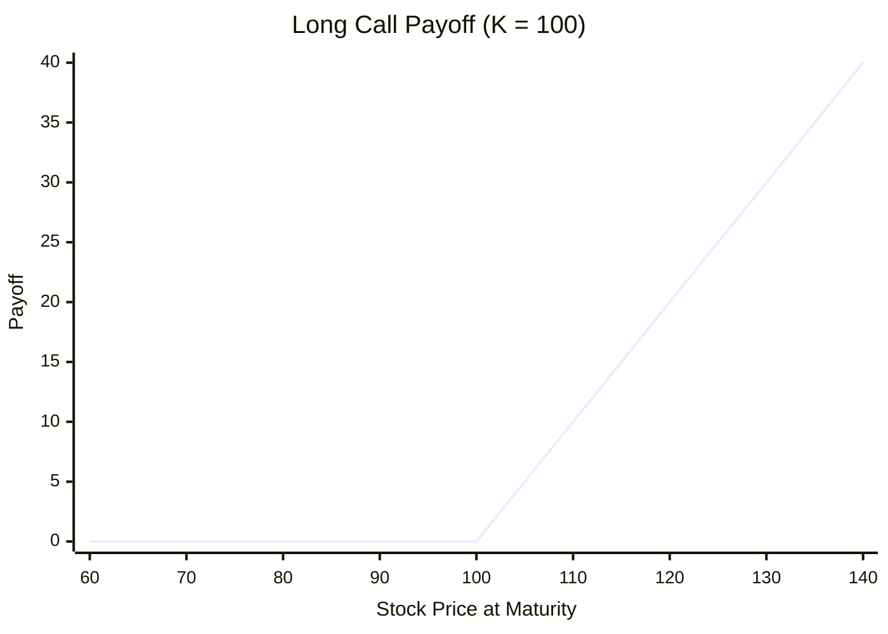
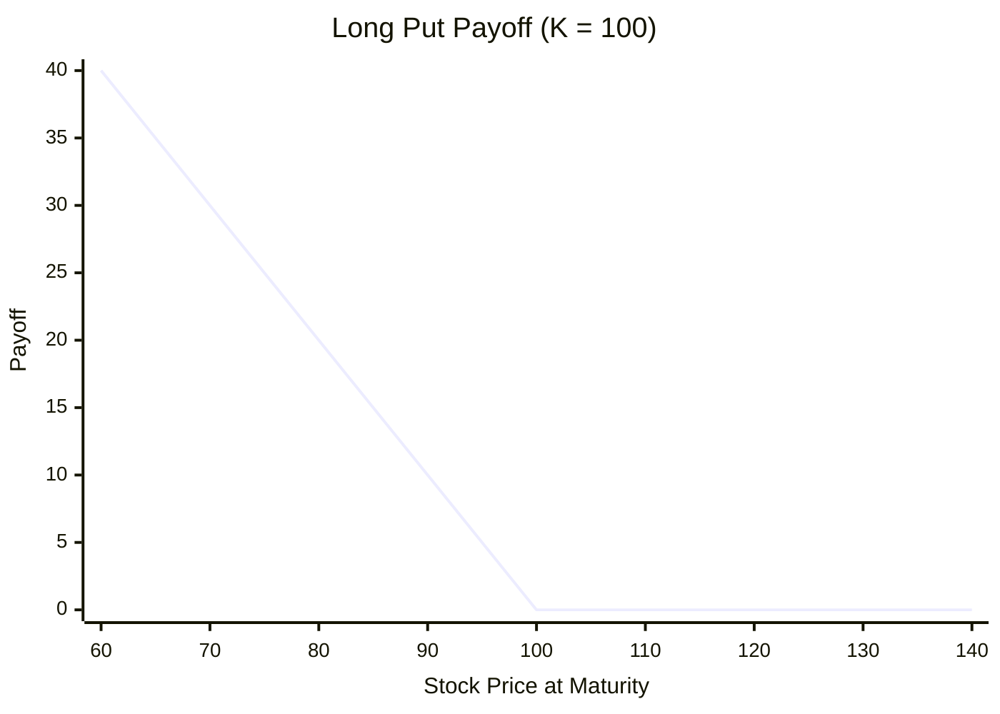

# Option Payoffs

The previous section defined what options are and introduced the key contract terms. We now turn to the central question: what is an option actually worth at maturity? The answer depends entirely on the relationship between the stock price $S_T$ and the strike price $K$ at expiration. The **payoff** of an option is its value at maturity, before accounting for the premium paid to enter the position. Understanding payoff functions is the first step toward pricing options at any earlier time.

---

## Call Option Payoff

The holder of a European call option has the right to buy the underlying asset at the strike price $K$ at maturity $T$. If the stock price $S_T$ exceeds $K$, the holder exercises and gains $S_T - K$. If $S_T \leq K$, exercise is worthless and the holder lets the option expire. The payoff is therefore

$$
(S_T - K)^+ = \max(S_T - K, \, 0)
$$

which can be written in piecewise form as

$$
\text{Call payoff} = \begin{cases} S_T - K & \text{if } S_T > K \\ 0 & \text{if } S_T \leq K \end{cases}
$$

The notation $(x)^+ = \max(x, 0)$ will appear throughout this text. It captures the holder's right to walk away: the payoff is never negative.

---

## Put Option Payoff

The holder of a European put option has the right to sell the underlying asset at the strike price $K$ at maturity $T$. If $S_T < K$, selling at $K$ is more favorable than selling at the market price, and the holder gains $K - S_T$. If $S_T \geq K$, the holder does not exercise. The payoff is

$$
(K - S_T)^+ = \max(K - S_T, \, 0)
$$

or equivalently

$$
\text{Put payoff} = \begin{cases} K - S_T & \text{if } S_T < K \\ 0 & \text{if } S_T \geq K \end{cases}
$$

Note the symmetry: a call profits from upward moves and a put profits from downward moves, but in both cases the payoff is bounded below by zero.

---

## Payoff Diagrams

The following diagrams show the characteristic "hockey stick" shapes of call and put payoffs for a strike of $K = 100$.

**Long call payoff**: flat at zero for $S_T \leq K$, then rising linearly.

**Long put payoff**: linearly decreasing for $S_T < K$, then flat at zero.

---

## Payoff Profiles

The following table shows the shape of call and put payoffs across a range of stock prices, for a strike of $K = 100$:

| $S_T$ | 70 | 80 | 90 | 100 | 110 | 120 | 130 |
|---|---|---|---|---|---|---|---|
| **Call** $(S_T - K)^+$ | 0 | 0 | 0 | 0 | 10 | 20 | 30 |
| **Put** $(K - S_T)^+$ | 30 | 20 | 10 | 0 | 0 | 0 | 0 |

The call payoff is a "hockey stick" shape: flat at zero for $S_T \leq K$, then rising linearly with slope 1 for $S_T > K$. The put payoff is the mirror image: linearly decreasing for $S_T < K$, then flat at zero. The kink at $S_T = K$ is the defining geometric feature of option payoffs and the source of the nonlinearity that makes pricing nontrivial.

---

## Long and Short Positions

Every option trade has two sides. The **long** party is the buyer (holder) of the option; the **short** party is the seller (writer). Their payoffs are mirror images:

| Position | Call payoff at $T$ | Put payoff at $T$ |
|---|---|---|
| Long (holder) | $(S_T - K)^+$ | $(K - S_T)^+$ |
| Short (writer) | $-(S_T - K)^+$ | $-(K - S_T)^+$ |

The writer's payoff is the **negative** of the holder's payoff. The option market is zero-sum at expiration: every dollar gained by the holder is lost by the writer, and vice versa. This is why the writer demands compensation upfront — the **premium** — in exchange for accepting this obligation.

---

## Numeric Example

Consider a European call and a European put, both with strike $K = 100$.

Suppose $S_T = 118$ at maturity:

- **Call payoff (long):** $(118 - 100)^+ = \$18$. The holder buys at \$100 and immediately has an asset worth \$118.
- **Put payoff (long):** $(100 - 118)^+ = \$0$. The holder would not sell at \$100 what is worth \$118.
- **Call payoff (short):** $-\$18$. The writer must deliver the asset at \$100, losing \$18.

Now suppose instead $S_T = 87$:

- **Call payoff (long):** $(87 - 100)^+ = \$0$. No exercise.
- **Put payoff (long):** $(100 - 87)^+ = \$13$. The holder sells at \$100 an asset worth only \$87.
- **Put payoff (short):** $-\$13$. The writer must buy at \$100 what is worth \$87.

These payoffs represent value at expiration only. To determine whether a trade was profitable overall, one must subtract the **premium** paid (for the long) or add the premium received (for the short). This raises a natural question: if the payoff depends on the unknown future price $S_T$, how should the premium be determined *today*? This is the central problem of option pricing, and we turn to it next.

---

## Exercises

**Exercise 1.** A European call option has strike $K = 75$. Compute the call payoff at maturity for each of the following stock prices: (a) $S_T = 60$, (b) $S_T = 75$, (c) $S_T = 90$.

??? success "Solution to Exercise 1"
    Using the call payoff formula $(S_T - K)^+$:

    (a) $(60 - 75)^+ = (-15)^+ = 0$. The call expires worthless.

    (b) $(75 - 75)^+ = 0^+ = 0$. At-the-money; the call has zero payoff.

    (c) $(90 - 75)^+ = 15^+ = \$15$. The holder exercises and gains \$15.

---

**Exercise 2.** A European put option has strike $K = 50$. The holder paid a premium of \$4. (a) Compute the payoff and profit when $S_T = 38$. (b) Find the stock price $S_T^*$ at which the holder breaks even (profit $= 0$).

??? success "Solution to Exercise 2"
    (a) Payoff $= (K - S_T)^+ = (50 - 38)^+ = \$12$. Profit $= 12 - 4 = \$8$.

    (b) The holder breaks even when payoff equals premium: $(50 - S_T^*)^+ = 4$. Since $S_T^* < 50$ is needed for a positive payoff, we solve $50 - S_T^* = 4$, giving $S_T^* = 46$.

---

**Exercise 3.** A trader writes (sells) a European call with strike $K = 200$ and receives a premium of \$15. (a) Write the writer's profit as a function of $S_T$. (b) What is the maximum profit? (c) Is there a maximum loss? Explain.

??? success "Solution to Exercise 3"
    (a) The writer's payoff at maturity is $-(S_T - K)^+$. Including the premium received, the writer's profit is

    $$
    \pi_{\text{writer}} = 15 - (S_T - 200)^+
    $$

    (b) Maximum profit occurs when $S_T \leq 200$ and the call expires worthless: $\pi_{\text{writer}} = 15 - 0 = \$15$.

    (c) There is no maximum loss. If $S_T > 200$, profit becomes $15 - (S_T - 200) = 215 - S_T$. As $S_T \to \infty$, the loss grows without bound. For example, if $S_T = 500$, the writer's loss is $500 - 215 = \$285$. This unbounded downside is the fundamental risk of writing naked calls.

---

**Exercise 4.** Show that for any stock price $S_T \geq 0$ and strike $K > 0$, the call and put payoffs satisfy

$$
(S_T - K)^+ - (K - S_T)^+ = S_T - K
$$

??? success "Solution to Exercise 4"
    Consider two cases.

    **Case 1: $S_T \geq K$.** Then $(S_T - K)^+ = S_T - K$ and $(K - S_T)^+ = 0$. The left side is $(S_T - K) - 0 = S_T - K$. $\square$

    **Case 2: $S_T < K$.** Then $(S_T - K)^+ = 0$ and $(K - S_T)^+ = K - S_T$. The left side is $0 - (K - S_T) = S_T - K$. $\square$

    In both cases the identity holds. This relation is the payoff version of **put-call parity**, which we will encounter in a more general discounted form when we study option pricing.

---

**Exercise 5.** A trader holds a long call and a short put, both European with the same strike $K$ and maturity $T$. Using the identity from Exercise 4, show that the combined payoff at maturity equals $S_T - K$. Why does this mean the combined position behaves like a forward contract?

??? success "Solution to Exercise 5"
    The combined payoff at maturity is

    $$
    (S_T - K)^+ - (K - S_T)^+ = S_T - K
    $$

    by the identity proved in Exercise 4. This payoff is linear in $S_T$ and equals $S_T - K$ regardless of whether $S_T$ is above or below $K$.

    A **forward contract** with delivery price $K$ obligates the holder to buy the asset at $K$ at maturity, yielding payoff $S_T - K$. Since the option combination produces the identical payoff in every state of the world, the two positions are economically equivalent at expiration. This is the payoff-level foundation of put-call parity: any difference in cost between the two positions must reflect the time value of money.
