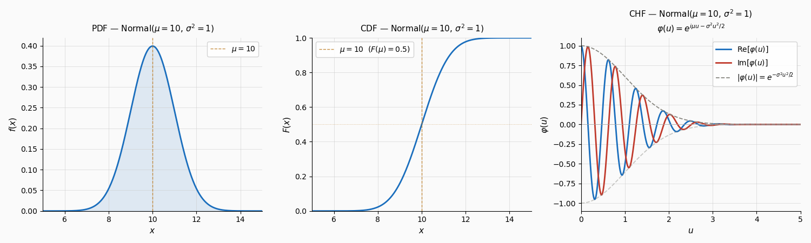

# From Characteristic Function to Density

Many financial models---including the Heston stochastic volatility model, variance gamma, and CGMY processes---provide the characteristic function of the log-price in closed form, but the density itself has no elementary expression. To price options, validate model behavior, or visualize the risk-neutral distribution, we need to invert the characteristic function back to the density. This section develops three approaches to this inversion: the classical Fourier inversion integral, the Gil--Pelaez formula for distribution functions, and the COS-method-based cosine series reconstruction. Each approach has distinct advantages depending on whether the goal is density recovery, distribution function computation, or option pricing.

!!! info "Prerequisites"
    - [Fourier Series of Probability Densities](../fourier_series/fourier_series_of_densities.md) (CF as Fourier transform of density)
    - [Cosine Expansion on $[0, \pi]$](../fourier_series/cosine_expansion.md) (cosine series)
    - Complex analysis: contour integration (for Gil--Pelaez)

!!! abstract "Learning Objectives"
    By the end of this section, you will be able to:

    1. State and apply the Fourier inversion theorem to recover a density from its CF
    2. Derive the Gil--Pelaez formula for the cumulative distribution function
    3. Implement numerical Fourier inversion using truncation and quadrature
    4. Reconstruct densities using the COS method's cosine series
    5. Identify the sources of numerical error in each approach

---

## Fourier Inversion Integral

The most direct route from characteristic function to density is the inverse Fourier transform.

!!! note "Theorem: Fourier Inversion"
    Let $X$ be a random variable with characteristic function $\phi(u) = \mathbb{E}[e^{iuX}]$. If $\phi \in L^1(\mathbb{R})$, then $X$ has a bounded continuous density

    $$
    f(x) = \frac{1}{2\pi}\int_{-\infty}^{\infty} e^{-iux}\phi(u)\,du
    $$

Since $\phi(-u) = \overline{\phi(u)}$ for real-valued $X$, the integral simplifies to a real form:

$$
f(x) = \frac{1}{\pi}\int_0^{\infty} \text{Re}\!\left[e^{-iux}\phi(u)\right] du
$$

This halving of the integration range exploits the conjugate symmetry of $\phi$ and is the form used in numerical implementations.

**Numerical implementation.** Truncate the integral to $[0, U]$ and apply quadrature:

$$
f(x) \approx \frac{1}{\pi}\sum_{j=0}^{M} w_j\,\text{Re}\!\left[e^{-iu_j x}\phi(u_j)\right]
$$

where $\{u_j, w_j\}$ are quadrature nodes and weights on $[0, U]$. The trapezoidal rule performs well because the integrand is smooth and decays for models with well-behaved characteristic functions.

!!! warning "Truncation Upper Limit $U$"
    The choice of $U$ matters: too small and the density is under-resolved (low frequency content only); too large and numerical cancellation degrades accuracy (the integrand oscillates rapidly for large $u$ when $x$ is far from the mean). A practical rule is to increase $U$ until the density reconstruction stabilizes, or to use the decay rate of $|\phi(u)|$ as a guide.

---

## Gil--Pelaez Inversion Formula

For option pricing, the cumulative distribution function (CDF) $F(x) = P(X \leq x)$ is often more useful than the density. The Gil--Pelaez (1951) formula provides the CDF directly from the characteristic function, avoiding the intermediate step of density computation.

!!! note "Theorem: Gil--Pelaez Formula"
    Let $X$ have characteristic function $\phi$. At every continuity point $x$ of $F$:

    $$
    F(x) = \frac{1}{2} - \frac{1}{\pi}\int_0^{\infty} \text{Im}\!\left[\frac{e^{-iux}\phi(u)}{u}\right] du
    $$

**Proof.** Start from the inversion formula for the CDF. For $\varepsilon > 0$:

$$
F(x) = \lim_{\varepsilon \to 0^+} \frac{1}{2\pi}\int_{-\infty}^{\infty} \frac{e^{-iux}\phi(u)}{-iu + \varepsilon}\,du
$$

This representation comes from writing $F(x) = \int_{-\infty}^x f(y)\,dy$ and substituting the Fourier inversion of $f$, then exchanging the order of integration (justified when $\phi \in L^1$ or via regularization). The inner integral evaluates to

$$
\int_{-\infty}^x e^{iuy}\,dy = \pi\delta(u) + \frac{e^{iux}}{iu}
$$

in the distributional sense. Substituting and simplifying:

$$
F(x) = \frac{1}{2}\phi(0) + \frac{1}{2\pi}\int_{-\infty}^{\infty} \frac{e^{-iux}\phi(u)}{iu}\,du
$$

Since $\phi(0) = 1$ and the integrand satisfies $\frac{e^{-iux}\phi(u)}{iu}$ is odd in its real part and even in its imaginary part (using $\phi(-u) = \overline{\phi(u)}$), the integral reduces to the imaginary part over $[0, \infty)$:

$$
F(x) = \frac{1}{2} - \frac{1}{\pi}\int_0^{\infty} \text{Im}\!\left[\frac{e^{-iux}\phi(u)}{u}\right] du
$$

$\square$

!!! tip "Numerical Advantage of Gil--Pelaez"
    The integrand decays as $O(|\phi(u)|/u)$, which is faster than the density inversion integrand $O(|\phi(u)|)$. This improved decay makes the Gil--Pelaez integral easier to evaluate numerically, often requiring fewer quadrature points.

---

## Density Recovery via the COS Method

The COS method provides an alternative approach to density reconstruction that avoids numerical integration entirely. Instead of evaluating a Fourier integral, the density is expanded as a truncated cosine series with coefficients computed from the characteristic function.

!!! note "Definition: COS Density Reconstruction"
    The COS approximation to the density $f$ on $[a, b]$ using $N$ terms is

    $$
    \hat{f}_N(x) = \sum_{k=0}^{N-1}{}' A_k \cos\!\left(\frac{k\pi(x-a)}{b-a}\right)
    $$

    where the cosine coefficients are approximated by

    $$
    A_k \approx \frac{2}{b-a}\,\text{Re}\!\left[\phi\!\left(\frac{k\pi}{b-a}\right)e^{-ik\pi a/(b-a)}\right]
    $$

The computational procedure is:

1. Choose truncation interval $[a, b]$ using cumulants of $X$
2. Evaluate $\phi(k\pi/(b-a))$ for $k = 0, 1, \ldots, N-1$
3. Compute $A_k$ via the formula above
4. Sum the cosine series at desired points $x$

This requires only $N$ evaluations of the characteristic function, with no quadrature or integration. For smooth densities, $N = 64$ to $128$ suffices for high accuracy.

---

## Comparison of Inversion Approaches

Each method has distinct strengths:

| Method | Output | Complexity | Accuracy | Best use case |
|---|---|---|---|---|
| Fourier inversion integral | Density $f(x)$ | $O(M)$ per point | Depends on $U$, quadrature | Single-point density evaluation |
| Gil--Pelaez | CDF $F(x)$ | $O(M)$ per point | Better decay, easier numerics | Distribution function, tail probabilities |
| COS reconstruction | Density $f(x)$ on grid | $O(N)$ setup + $O(N)$ per point | Exponential for smooth $f$ | Density on grid, visualization |

The COS method dominates for grid-based density recovery because the coefficient computation is done once and then reused for all evaluation points.

---

## Example: Normal Density Recovery

To validate the inversion approaches, consider the standard normal distribution.

!!! example "Recovering $N(0,1)$ Density"
    For $X \sim N(0, 1)$, the characteristic function is $\phi(u) = e^{-u^2/2}$.

    **Fourier inversion:**

    $$
    f(x) = \frac{1}{\pi}\int_0^{\infty} e^{-u^2/2}\cos(ux)\,du = \frac{1}{\sqrt{2\pi}}e^{-x^2/2}
    $$

    The integral evaluates in closed form (completing the square in the exponent), recovering the Gaussian density exactly.

    **COS reconstruction** on $[-10, 10]$ with $N = 64$:

    The cosine coefficients are $A_k = \frac{1}{10}\,\text{Re}[e^{-k^2\pi^2/800}\cdot e^{ik\pi/2}]$. The reconstructed density matches the true density to better than $10^{-10}$ at all points in $[-8, 8]$, with larger errors only near the boundaries where the density is already negligible ($f(\pm 10) \approx 10^{-23}$).

    **Gil--Pelaez:**

    $$
    F(x) = \frac{1}{2} - \frac{1}{\pi}\int_0^{\infty} \frac{e^{-u^2/2}\sin(ux)}{u}\,du = \Phi(x)
    $$

    This recovers the standard normal CDF. The integrand $e^{-u^2/2}\sin(ux)/u$ is bounded and rapidly decaying, so the trapezoidal rule with $M = 100$ points on $[0, 20]$ achieves $10^{-12}$ accuracy.

### Python: PDF, CDF, and Characteristic Function of Normal($\mu$, $\sigma^2$)

The following code plots all three objects simultaneously for Normal($\mu = 10$, $\sigma^2 = 1$), illustrating the three panels: PDF $f(x)$, CDF $F(x)$, and the characteristic function $\varphi(u)$ showing its real part, imaginary part, and Gaussian modulus envelope $|\varphi(u)| = e^{-\sigma^2 u^2/2}$.

```python
"""
Normal Distribution: PDF, CDF, and Characteristic Function
===========================================================
Plots the probability density function, cumulative distribution function,
and characteristic function of a Normal(mu, sigma^2) distribution.

The characteristic function of X ~ Normal(mu, sigma^2) is:

    phi(u) = E[e^{iuX}] = exp(i * mu * u - sigma^2 * u^2 / 2)

which is a complex-valued function of the real argument u.
We plot its real part Re[phi(u)] and imaginary part Im[phi(u)] as a
2-D panel, alongside the Gaussian modulus envelope exp(-sigma^2 u^2 / 2).
The envelope decays regardless of mu, reflecting the Riemann-Lebesgue lemma.
"""

import numpy as np
import matplotlib.pyplot as plt
import scipy.stats as st

# ── Parameters ────────────────────────────────────────────────────────────────
mu    = 10.0   # mean
sigma =  1.0   # standard deviation

# ── Functions ─────────────────────────────────────────────────────────────────
i = complex(0, 1)

def chf(u: np.ndarray) -> np.ndarray:
    """Characteristic function of Normal(mu, sigma^2)."""
    return np.exp(i * mu * u - sigma**2 * u**2 / 2.0)

def pdf(x: np.ndarray) -> np.ndarray:
    """Probability density function of Normal(mu, sigma^2)."""
    return st.norm.pdf(x, mu, sigma)

def cdf(x: np.ndarray) -> np.ndarray:
    """Cumulative distribution function of Normal(mu, sigma^2)."""
    return st.norm.cdf(x, mu, sigma)

# ── Grids ─────────────────────────────────────────────────────────────────────
x = np.linspace(mu - 5 * sigma, mu + 5 * sigma, 400)   # support for PDF / CDF
u = np.linspace(0, 5, 500)                              # frequency axis for CHF

# ── Evaluate ──────────────────────────────────────────────────────────────────
chf_vals = chf(u)
re_vals  = np.real(chf_vals)
im_vals  = np.imag(chf_vals)
mod_vals = np.abs(chf_vals)     # Gaussian envelope exp(-sigma^2 u^2 / 2)

# ── Colors ────────────────────────────────────────────────────────────────────
FACECOLOR = '#FAFAFA'
COLOR_MAIN = '#1A6EBD'
COLOR_RE   = '#1A6EBD'
COLOR_IM   = '#C0392B'
COLOR_MOD  = '#888780'
COLOR_MU   = '#BA7517'


def _style(ax, xlabel: str, ylabel: str, title: str) -> None:
    """Apply shared axis style."""
    ax.set_facecolor(FACECOLOR)
    ax.set_xlabel(xlabel, fontsize=11)
    ax.set_ylabel(ylabel, fontsize=11)
    ax.set_title(title, fontsize=11, pad=8)
    ax.spines[['top', 'right']].set_visible(False)
    ax.grid(True, linewidth=0.4, color='#CCCCCC')


# ── Single figure, three axes ─────────────────────────────────────────────────
fig, (ax1, ax2, ax3) = plt.subplots(1, 3, figsize=(15, 4.5))
fig.patch.set_facecolor(FACECOLOR)

# ── Axis 1: PDF ───────────────────────────────────────────────────────────────
ax1.plot(x, pdf(x), color=COLOR_MAIN, linewidth=2.0)
ax1.fill_between(x, pdf(x), alpha=0.12, color=COLOR_MAIN)
ax1.axvline(mu, color=COLOR_MU, linewidth=1.0, linestyle='--', alpha=0.8,
            label=rf'$\mu = {mu:.0f}$')
_style(ax1, xlabel=r'$x$', ylabel=r'$f(x)$',
       title=rf'PDF — Normal$(\mu={mu:.0f},\,\sigma^2={sigma**2:.0f})$')
ax1.legend(fontsize=10, framealpha=0.85)
ax1.set_xlim(x[0], x[-1])
ax1.set_ylim(bottom=0)

# ── Axis 2: CDF ───────────────────────────────────────────────────────────────
ax2.plot(x, cdf(x), color=COLOR_MAIN, linewidth=2.0)
ax2.axvline(mu, color=COLOR_MU, linewidth=1.0, linestyle='--', alpha=0.8,
            label=rf'$\mu = {mu:.0f}$  ($F(\mu)=0.5$)')
ax2.axhline(0.5, color=COLOR_MU, linewidth=0.7, linestyle=':', alpha=0.5)
_style(ax2, xlabel=r'$x$', ylabel=r'$F(x)$',
       title=rf'CDF — Normal$(\mu={mu:.0f},\,\sigma^2={sigma**2:.0f})$')
ax2.legend(fontsize=10, framealpha=0.85)
ax2.set_xlim(x[0], x[-1])
ax2.set_ylim(0, 1)

# ── Axis 3: CHF (Re, Im, modulus) ─────────────────────────────────────────────
ax3.plot(u, re_vals,   color=COLOR_RE,  linewidth=2.0,
         label=r'$\mathrm{Re}[\varphi(u)]$')
ax3.plot(u, im_vals,   color=COLOR_IM,  linewidth=2.0,
         label=r'$\mathrm{Im}[\varphi(u)]$')
ax3.plot(u,  mod_vals, color=COLOR_MOD, linewidth=1.3, linestyle='--',
         label=r'$|\varphi(u)| = e^{-\sigma^2 u^2/2}$')
ax3.plot(u, -mod_vals, color=COLOR_MOD, linewidth=1.3, linestyle='--', alpha=0.45)
ax3.axhline(0, color='#AAAAAA', linewidth=0.6)
_style(ax3, xlabel=r'$u$', ylabel=r'$\varphi(u)$',
       title=(rf'CHF — Normal$(\mu={mu:.0f},\,\sigma^2={sigma**2:.0f})$'
              '\n'
              r'$\varphi(u)=e^{i\mu u - \sigma^2 u^2/2}$'))
ax3.legend(fontsize=10, framealpha=0.85)
ax3.set_xlim(u[0], u[-1])

# ── Save ──────────────────────────────────────────────────────────────────────
plt.tight_layout()
plt.savefig('pdf_cdf_and_characteristic_function.svg', bbox_inches='tight')
plt.show()
```

<figure markdown="span">
  
  <figcaption markdown="span">**Figure 1:** PDF, CDF, and characteristic function of Normal($\mu = 10$, $\sigma^2 = 1$). Left: the density $f(x)$ with mean marked. Centre: the CDF $F(x)$ with $F(\mu) = 0.5$ highlighted. Right: the characteristic function $\varphi(u) = e^{i\mu u - \sigma^2 u^2/2}$, showing its real part (blue), imaginary part (red), and Gaussian modulus envelope $|\varphi(u)| = e^{-\sigma^2 u^2/2}$ (gray dashed). The oscillation frequency of Re and Im grows with $\mu$, while the envelope decays purely with $\sigma^2$, independently of $\mu$ — a direct consequence of the Riemann–Lebesgue lemma.</figcaption>
</figure>

---

## Example: Heston Model Density

The Heston model provides a characteristic function in closed form but no elementary density, making it the prototypical use case for Fourier inversion.

!!! example "Heston Density Inversion"
    Under the Heston model, the log-price $X_T = \ln(S_T/S_0)$ has characteristic function

    $$
    \phi(u) = \exp\!\left(C(u, T) + D(u, T)v_0 + iux_0\right)
    $$

    where $C$ and $D$ satisfy Riccati ODEs depending on the parameters $(\kappa, \theta, \sigma_v, \rho, v_0)$ and $x_0 = \ln S_0$. The explicit forms are:

    $$
    D(u, T) = \frac{\kappa - \rho\sigma_v iu - d}{\sigma_v^2}\cdot\frac{1 - e^{-dT}}{1 - g\,e^{-dT}}
    $$

    $$
    C(u, T) = (r - q)iuT + \frac{\kappa\theta}{\sigma_v^2}\left[(\kappa - \rho\sigma_v iu - d)T - 2\ln\!\left(\frac{1 - g\,e^{-dT}}{1-g}\right)\right]
    $$

    with $d = \sqrt{(\rho\sigma_v iu - \kappa)^2 + \sigma_v^2(iu + u^2)}$ and $g = (\kappa - \rho\sigma_v iu - d)/(\kappa - \rho\sigma_v iu + d)$.

    Using the COS method with $N = 128$ and a cumulant-based truncation interval, the density is recovered accurately for typical parameter sets. The density exhibits negative skew and excess kurtosis compared to the log-normal, reflecting the stochastic volatility and leverage effect.

---

## Numerical Considerations

Several practical issues arise in Fourier inversion:

**Oscillatory integrands.** For large $|x|$, the integrands in both the Fourier inversion and Gil--Pelaez formulas oscillate rapidly, requiring more quadrature points or adaptive methods.

**Branch cuts in the CF.** The Heston model's characteristic function involves complex square roots that require careful branch selection. The "rotation count" algorithm of Kahl and Jackel (2005) ensures continuity of $\phi(u)$ along the real $u$-axis.

**Aliasing in the COS method.** The cosine series assumes the density is supported on $[a, b]$. If significant probability mass lies outside this interval, the density reconstruction suffers from aliasing (the tail mass is "folded back" into $[a, b]$). The cumulant-based truncation rule prevents this in practice.

!!! warning "Negative Density Values"
    The COS reconstruction is a truncated series of oscillating functions and is not guaranteed to produce non-negative values everywhere. For densities with sharp features or when $N$ is too small, the reconstruction may exhibit negative values, particularly near boundaries. This is a truncation artifact, not a model error.

---

## Summary

Recovering a density from its characteristic function is the gateway to Fourier-based option pricing:

| Method | Formula | Key advantage |
|---|---|---|
| Fourier inversion | $f(x) = \frac{1}{\pi}\int_0^\infty \text{Re}[e^{-iux}\phi(u)]\,du$ | Direct, exact in principle |
| Gil--Pelaez | $F(x) = \frac{1}{2} - \frac{1}{\pi}\int_0^\infty \text{Im}[\frac{e^{-iux}\phi(u)}{u}]\,du$ | CDF directly, better decay |
| COS reconstruction | $\hat{f}_N(x) = \sum_{k=0}^{N-1}{}' A_k\cos(\cdots)$ | No integration, exponential convergence |

**The COS method's cosine series reconstruction provides the most efficient density recovery for smooth distributions, requiring only $N$ characteristic function evaluations and no numerical quadrature, which is why it has become the preferred approach for model validation and option pricing in practice.**

---

## Exercises

**Exercise 1.** Starting from the Fourier inversion formula $f(x) = \frac{1}{2\pi}\int_{-\infty}^{\infty}e^{-iux}\phi(u)\,du$, use the conjugate symmetry $\phi(-u) = \overline{\phi(u)}$ (for real-valued $X$) to derive the real-valued form $f(x) = \frac{1}{\pi}\int_0^{\infty}\text{Re}[e^{-iux}\phi(u)]\,du$. Show each step of the simplification.

---

**Exercise 2.** Derive the Gil-Pelaez formula $F(x) = \frac{1}{2} - \frac{1}{\pi}\int_0^{\infty}\text{Im}[\frac{e^{-iux}\phi(u)}{u}]\,du$ starting from $F(x) = \int_{-\infty}^{x}f(y)\,dy$. Explain why the integrand decays as $O(|\phi(u)|/u)$ and why this improved decay (compared to the density inversion integrand) makes the Gil-Pelaez integral easier to evaluate numerically.

---

**Exercise 3.** For the standard normal distribution with $\phi(u) = e^{-u^2/2}$, evaluate the Gil-Pelaez integrand $\text{Im}[e^{-iux}\phi(u)/u]$ at $x = 0$ and simplify. Explain why $F(0) = 1/2$ follows from the formula, and estimate the number of trapezoidal rule quadrature points needed on $[0, 20]$ to achieve $10^{-10}$ accuracy.

---

**Exercise 4.** The COS density reconstruction uses $\hat{f}_N(x) = \sum_{k=0}^{N-1}{}' A_k\cos(k\pi(x-a)/(b-a))$ with $A_k$ computed from the characteristic function. For $N(0,1)$ on $[-10, 10]$, compute the reconstruction error $|\hat{f}_{64}(0) - f(0)|$ and $|\hat{f}_{64}(3) - f(3)|$. Explain why the error at $x = 3$ is comparable to the error at $x = 0$ despite the density being much smaller there.

---

**Exercise 5.** Compare the three density inversion approaches (Fourier inversion, Gil-Pelaez, COS reconstruction) for the Heston model. For each method, list the required inputs, the computational cost to evaluate the density at a single point, and the main source of numerical error. Which method would you choose for (a) evaluating $f(x)$ at a single point, (b) plotting $f(x)$ on a grid of 1000 points?

---

**Exercise 6.** The COS reconstruction can produce negative density values near the boundaries of $[a, b]$, which is a truncation artifact. Explain why this occurs in terms of the Gibbs phenomenon for truncated cosine series. Propose two strategies to mitigate negative density values and discuss the tradeoff each introduces.
